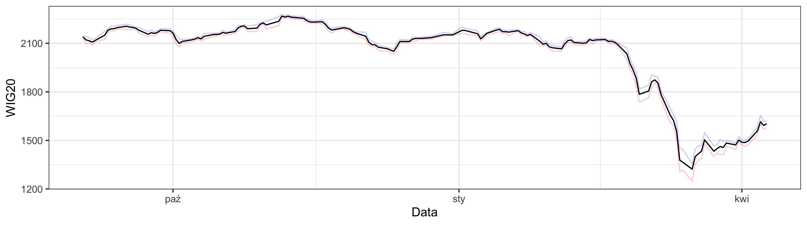
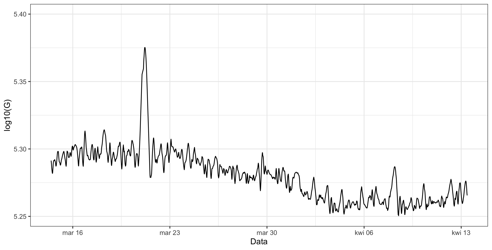
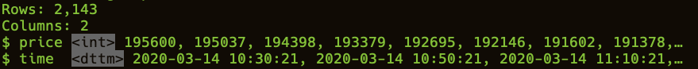
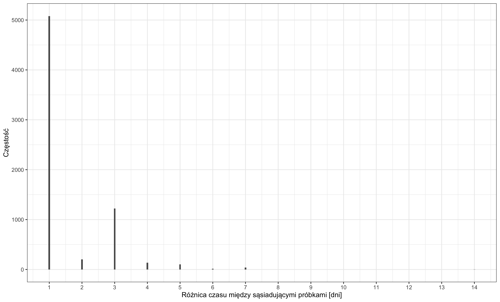

# Wprowadzenie

  Celem niniejszego dokumentu jest przedstawienie wstępnych założeń
  dotyczących realizacji projektu analizy algorytmów detekcji anomalii w szeregach czasowych, tj. TSAD (z ang. __time series anomaly detection__).
  W jego ramach zostanie omówiona domena problemu, tj. przebiegi wartości instrumentów finansowych na różnych typach rynków, model zjawiska detekcji anomalii oraz plan eksperymentów. Opisane zostaną również metryki jakości uzyskiwanych rozwiązań jak i źródło pozyskiwanych danych.

# Kursy instrumentów finansowych
  
  Przebieg kursów instrumentów finansowych jak na przykład kursów akcji spółek lub indeksów giełdowych jest fundamentem działania inwestorów na rynkach. 
  Jego zachowanie determinuje strategie oraz ryzyko inwestycyjne. 
  W związku z powyższym faktem kursy akcji są szczególnie interesujące 
  nie tylko dla bezpośrednich aktorów rynkowych, ale również ekonomistów 
  lub statystyków, którzy opracowują modele zachowań tych kursów lub rynków w ogólności.
  Współcześnie bardzo dużo uwagi poświęca się zagadnieniom predykcji przyszłych wartości kursów, co stanowi złożony i trudny problem, biorąc pod uwagę
  fakt, że jedna z dominujących teorii rynkowych, tj. EFM (z ang. __efficient-market hypothesis__) uważa za niemożliwe dokonywanie
  przydatnych predykcji [@RandomWalk] przyszłych kursów, a ponadto uznaje się, że rynki finansowe nie są obojętne na predykcje jak np. pogoda [@Sapiens].
  Niemniej jednak problem predykcji przyszłych wartości kursów nie jest jedynym zagadnieniem, które ma praktyczne znaczenie.
  Możliwość odróżnienia niestandardowych fluktuacji kursów i tym samym punktów odstających może stanowić istotną informację dla inwestorów i zaangażować
  dedykowane takim zdarzeniom procesy biznesowe. Szczególnie istotne wydaje się to z punktu widzenia zautomatyzowanych rynków giełdowych, w których 
  akcje podejmowane przez aktorów (systemy decyzyjne) mierzone są w milisekundach, a dane giełdowe mogą być traktowane jako strumieniowe [@HFT-wiki]. Wówczas wykrycie anomalii i jej odpowiednie obsłużenie wydaje się być krytyczne dla gracza rynkowego.

  W ramach realizacji projektu użyte zostaną łącznie dwa zbiory danych, na które składają się przebiegi kursów instrumentów finansowych. Jeden z nich będzie pochodzić z rzeczywistego rynku finansowego, a drugi z rynku wirtualnego. 
  Motywacją takiego podejścia jest chęć zaobserwowania zachowania się rynku w świecie, w którym na wartość kursu wpływa bardzo duża liczba czynników jawnych lub niejawnych, oraz w świecie, w którym zbiór możliwych akcji podejmowanych przez aktorów jest znacząco ograniczony oraz sam świat ma raczej charakter statyczny i iteracyjny.
  Ponadto dodatkową motywacją za skorzystaniem z danych pochodzących z rynku wirtualnego jest łatwość określenia zdarzeń, które powoduję nagłe zmiany przebiegu kursu -- co zostanie bardziej szczegółowo opisane w podsekcji poświęconej temu rynkowi. 

## Rynki rzeczywiste

  *Indeks giełdowy WIG20* jest statystyką (średnia ważona kapitalizacją spółek) obrazującą zmianę cen akcji dwudziestu największych spółek akcyjnych notowanych na Warszawskiej Giełdzie Papierów Wartościowych. Wartość indeksu pozwala ocenić inwestorom ogólny kierunek zmian cen i stan rynku.  

  Przebieg indeksu WIG20 w wybranym przedziale czasowym pokazany jest na rysunku poniżej.

  

## Rynki wirtualne

  *WoW Token* jest przedmiotem w grze MMO-RPG (_Massively multiplayer online role-playing game_) _World of Warcraft_, który przez gracza może zostać wykorzystany w następujące sposoby:
  
  * gracz może kupić token za rzeczywistą walutę (USD, GBP, EUR, TWD, KRW), a następnie sprzedać go w umieszczonym w grze domu handlowym (_Auction House_) 

  * gracz może kupić token, płacąc fikcyjną walutą obowiązującą w świecie _World of Warcraft_ (dalej G), a następnie wymienić go na przedłużenie abonamentu gry lub wymienić go na bon w internetowym sklepie wydawcy gry. 

  Kurs wymiany G/USD jest stały i wynosi $20$ [^1] natomiast kurs tokena w świecie gry jest zmienny i zależy głównie od podaży i popytu [@wtoken-info].

  Przebieg ceny tokena w grze na serwerach europejskich w wybranym czasie jest pokazany na poniższym rysunku.

  

  [^1]: To samo tyczy się jakiejkolwiek innej waluty rzeczywistej.
 

# Zadanie detekcji anomalii 

  W rozdziale tym zostanie zdefiniowany w ogólny sposób problem detekcji anomalii w szeregach czasowych. Konkretyzacja ogólnych pojęć zdefiniowanych poniżej zostanie przedstawiona w rozdziale dotyczącym algorytmów detekcji.

  Przez zadanie detekcji anomalii w trakcie realizacji projektu będziemy rozumieć następujący problem:

  Szereg czasowy
  : niech $(X_{i})_{i \in T}$ będzie procesem stochastycznym określonym na pewnej przestrzeni probabilistycznej, a zbiór indeksów $T$ będzie interpretowany jako zbiór chwil czasowych jednakowo odległych od siebie.
  Realizację tego procesu, tj. uporządkowany zbiór $\{x{_t}\}_{t = 1, \dots, N}$, będziemy nazywać szeregiem czasowym. Nie zakładamy ponadto niczego względem stacjonarności tego szeregu lub rozkładu prawdopodobieństwa, z którego jest on generowany poza faktem, że jego nośnikiem jest zbiór liczb
  rzeczywistych $\mathcal{R}$.

  Anomalia
  : Anomalią w szeregu czasowym będziemy nazywali punkt w tym szeregu  $x_{k}$, który według przyjętego kryterium _odstaje_ od pozostałych punktów w najbliższym sąsiedztwie $x_{k - s}, \dots, x_{k + s}$ (anomalia lokalna) lub względem wszystkich punktów w szeregu (anomalia globalna). 
  Kryterium _odstawania_ jest silnie zależne od kontekstu i procedury detekcji anomalii. Często przyjmowane kryterium wygląda następująco [@ad_review]:
  
  $|x_t - s(\{X_{t}\})| > \tau$

  przy czym $s(\{X_{t}\})$ jest pewną statystyką. 

  Detekcja anomalii

  : Detekcją anomalii będziemy nazywali procedurę, pozwalającą wykryć w szeregu czasowym zbiór indeksów punktów uznawanych za anomalię:

  $AD\colon \{X_{t}\} \rightarrow T_{A} sub T$.

# Algorytmy detekcji anomalii
  
  W rozdziale tym zostaną opisane algorytmy służące do detekcji anomalii, które w ramach projektu zamierzamy zbadać. 
  Opis ten nie będzie zawierał dokładnego pseudokodu, a jedynie pewien formalizm matematyczny, który pozwala zobrazować idee stojące za omawianymi metodami. Ponadto wskazane i omówione zostaną parametry tych metod.

  Omawiane metody 

## MAD

  Metoda _MAD_, tj. _median absolute deviation_ jest stosunkowo prostym sposobem detekcji anomalii opartym na oknie kroczącym (z ang. _moving window) o długości $k$. Dla każdego punktu metoda estymuje dwie rzeczy:

  1. medianę w oknie 
  2. bezwzględne odchylenie mediany.

  Model można sformalizować w następujący sposób:

  dla każdego punktu szeregu czasowego $x_{i}$ liczona jest wielkość
  
  $MAD_{i} = median_{i}[x_{i} - median_{j}(X_{j})]$.

  Następnie każdy punkt szeregu czasowego porównywany jest z odpowiadającą mu wartość $MAD_{\star}$ -- jeśli wartość bezwzględna różnicy między tym punktem, a wartością $MAD$ jest większa od ustalonego progu, to punkt jest klasyfikowany jako anomalia. W nawiązaniu do rozdziału poprzedzającego [r3] podane tam kryterium w sposób ogólny konkretyzuje się do postaci:

  $|x_{t} - MAD_{t}| > \tau$.

## STL-ESD

  Metoda STL (z ang. _Seasonal-Trend decomposition using Loess_) opiera się na dekompozycji addytywnej szeregu czasowego na trzy składowe w następującej formie
  
  $x_{t} = \tau_{t} + s_{t} + r_{t}, t = 1, \dots, N$

  gdzie $x_{t}$ jest obserwowaną wartością szeregu czasowego, $\tau_{t}$ jest składową trendu, $s_{t}$ składową sezonowości, a $r_{t}$ składową rezyduów.
  Dekompozycja taka jest dedykowana szeregom czasowym z zauważalnymi wolnozmiennymi fluktuacjami sezonowości oraz szybkozmiennymi zmianami składowej trendu [@wen-gao]. Zakłada się ponadto, że składowa rezyduów zawiera całą pozostałą informację o szeregu czasowym -- m.in. szum.
  Można to sformalizować w następujący sposób:
  
  $r_{t} = a_{t} + \epsilon_{t}$

  przy czym składowa $\epsilon_{t}$ jest składową szumu, a $a_{t}$ modeluje poszukiwane anomalie w postaci nagłych przyrostów wartości (t.zw. _peak_'ów).
  Dekompozycja STL jest procedurą iteracyjną i szczegółowo zostanie opisana w dokumentacji końcowej projektu. Na potrzeby tego dokumentu należy zaznaczyć, że wynikiem dekompozycji jest składowa $a_{t}$, a składowa:

  * szumu $\epsilon_{t}$ jest usuwana wskutek operacji filtracji (ang. _denoising_) przy pomocy średniej/medianie kroczącej lub probabilistycznemu wygładzaniu eksponencjalnego (PEWMA) [@PEWMA], co pozwala uzyskać sygnał postaci
  * trendu $\tau_{t}$ jest usuwana wskutek operacji detrendyzacji, która w najprostszym wariancie sprowadza się do zastosowania operatora różnicowego $\nabla x_{t} = x_{t} - x_{t -1}$ lub do filtrów kroczących
  * sezonowości $s_{t}$, która jest usuwana w standardowym standardzie metody STL przy pomocy LOESS (ang. _locally estimated scatterplot smoothing_), tj. metody łączącej działanie średniej kroczącej z regresją wielomianową [@stl-origin]. 

  STL zawiera trzy parametry sterujące metodą:

  1. $n_{p}$ liczbę obserwacji, która jest rozważana w każdym cyklu wyliczania składowej sezonowości
  2. $n_{i}$ liczbę iteracji wewnętrznej pętli algorytmu
  3. $n_{o}$ liczbę iteracji pętli zewnętrznej

  oraz trzy lub więcej parametrów sterujących detrendyzacją, usunięciem szumu oraz ekstrakcją sezonowości.

  Po otrzymaniu składowej $a_{t}$ stosowany jest test statystyczny ESD (z ang. _Extreme Studentized Deviate), w który służy do wykrycia anomalii w próbie o rozkładzie *asymptotycznie* normalnym. Jest on uogólnieniem testu Grubbs'a, w którym rozkład normalny próby jest warunkiem koniecznym.
  Test ESD rozważa dwie hipotezy

  $H_0\colon$ w próbie $\{a_1, \dots, a_{n}$ nie ma punktów odstających (anomalii)
  $H_1\colon$ w próbie $\{a_1, \dots, a_{n}$ jest co najwyżej $K$ punktów odstających.

  $i$-ta statystyka testowa ESD wyliczana jest w następujący sposób:

  $T^{ESD}_{i} = \frac{\max_{i}|a_{i} - \bar{a}}{\sigma}$

  gdzie $\bar{a} oznacza średnią z próby, a $\sigma$ odchylenie standardowe z próby. Po wyliczeniu $T^{ESD}_{i}$ usuwana jest z próby obserwacja maksymalizująca licznik i liczona jest kolejna statystyka testowa na podstawie zmodyfikowanej próby.

  Po wyliczeniu $\{T^{ESD}_{i}\}_{i = 1, \dots, K}$ wyliczane są wartości krytyczne testu $\lambda_{i}$ będące funkcją rozkładu t-studenta z $N - i$ stopniami swobody.

  Liczbę anomalii w próbie znajduje się przez podanie największego $i$ takiego, że $T^{ESD}_{i} > \lambda_{i}$.

  W kontekście definicji procedury detekcji anomalii podanej [r3] należy wybrać z próby $i$ największych elementów i ich znaczniki umieścić w zbiorze $T_{A}$.

  Dekompozycja szeregu czasowego przez algorytm STL  znajduje się na poniższym obrazku.

  
  

## CAD k-NN

  Metoda CAD k-NN (z ang. _Conformal Anomaly Detection k-Nearest Neighbours)

## Las izolacyjny

  Algorytm ten wybiera losową wartość podziału w przedziale między maksymalną a minimalną wartością cechy. w ten sposób dzielony jest cały zakres wartości cechy.W efekcie powstaje drzewo binarne w którym, ilość podziałów wymagana do wyizolowania próbki jest równa odległości od liścia do korzenia. Funkcją decyzyjną jest ta odległość, uśredniona względem drzew lasu. Jest ona miarą czy dana próbka jest anomalią czy nie.
  \[s(x, n) = 2^{\frac{-E(h(x)}{c(n)}}\]
  gdzie $E(h(x))$ jest uśrednioną względem wszystkich drzew długością ścieżki (ilością węzłów) prowadzącej od liścia do korzenia, $c(n)$ jest średnią długością ścieżki w drzewie, a $n$ jest ilością węzłów drzewa. \\
  Próbki będące anomaliami zwykle wymagają mniejszej ilości podziałów aby przejść z przenia do liści. Gdy funkcja $s(x, n)$ osiąga wartości bliskie 1 to badany punkt z dużym prawdopodobieństwem jest anomalią, jeśli natomiast osiąga wartości bliskie 0.5 to punkt jest normalny.  \\
  Dane zostaną poddane standaryzacji przez odjęcie wartości średniej i podzielenie przez odchylenie standardowe. Nie wymagają one innych operacji wykonywanych w oknie czasowym przy zastosowaniu tej metody. 
  Algorytm ten ma jeden parametr - rate. Kontroluje on jaka część próbek średnio będzie uznawanych za anomalię. Przyjmuje wartości z zakresu $[0,1]$. Parametr ten zostanie dobrany eksperymentalnie. 

## Metody spektralne

# Charakterystyka zbiorów danych

  Zbiory danych użyte do analizy działania algorytmów zostały częściowo omówione w rozdziale [r2]. 
  W niniejszym rozdziale zostaną wskazane źródła, z których pochodzą dane, oraz podana zostanie krótka charakterystyka tych danych.

  Kompletna analiza statystyczna danych, na którą będzie składało się zbadanie rozkładu danych, autokorelacji szeregu czasowego lub jego innych właściwości jak stacjonarność zostanie umieszczona w dokumentacji końcowej.

## WIG20

  Historyczne dane `WIG20` dostępne są do pobrania ze strony [stooq.pl](https://stooq.pl/q/d/?s=wig20) z interwałem:
  
  * dziennym
  * tygodniowym
  * miesięcznym
  * kwartalnym
  * rocznym.

  Dane pobierane są w formacie `CSV` i nie zawierają wartości brakujących.
  Struktura zbioru danych przedstawiona jest na poniższym obrazku. 

  

  

  Należy jednak zaznaczyć, że rozważaną w projekcie wartością szeregu czasowego jest uśredniona wartość indeksu z wartości otwarcia, zamknięcia oraz wartości najmniejszej i największej danej sesji.

  Wartości indeksu WIG20 dostępne są od 16 kwietnia 1991 do dnia dzisiejszego (02.04.2020) z tą uwagą, że nie we wszystkich przypadkach zachowany jest wymagany interwał, co jest zaznaczone na rysunku poniżej.

  
  
  

  W związku z tym do badań zostanie użyty najdłuższy podciąg, w którym odstęp między danymi wynosi jedną dobę.

## WoW Token

  Historyczne kursy tokena dostępne są na stronie [wowtokenprices.com](https://wowtokenprices.com/). Serwis udostępnia API, które umożliwia pobrania danych z kwantem 20-minutowym, które nie zawierają wartości brakujących, od początku istnienia tokena, tj. od roku 2015. 
  Kurs tokena różni się między regionami, w których znajdują się serwery. Dostępnych jest 5 regionów, tj. 

  1. europejski
  2. amerykański
  3. chiński
  4. tajwański
  5. koreański.
  
  W ramach projektu interesujące będą tylko dane z regionu europejskiego.

  Struktura zbioru danych z ostatniego miesiąca widoczna jest na na poniższym obrazku. 

  
  

# Plan badań

  Celem projektu jest zbadanie i porównanie metod detekcji anomalii w szeregach czasowych przy pomocy danych scharakteryzowanych we wcześniejszych rozdziałach.

  Przyjęta metodologia zakłada, że zadanie detekcji anomalii zostanie potraktowane jak zadanie klasyfikacji binarnej. Oznacza to, że przykłady w zbiorze danych zostaną oznaczone flagą, która informuje o tym czy dany przykład jest anomalią czy też nie.

  Przydział flagi będzie odbywał się na dwa sposoby:

  1. autorzy manualnie wybiorą podzbiór zdarzeń, których zajście spowodowało znaczny przyrost lub spadek indeksu/wartości tokena i oznaczą je jako anomalie. Przykłady takich zdarzeń są następujące:

    * kryzys gospodarczy z 2008 roku (ogłoszenie upadłości przez bank _Lehman Brothers_) (WIG20)
    * rozpoczęcie stanu epidemicznego w Polsce w związku z pandemią koronawirusa SARS-CoV-2 (WIG20)
    * atak Iranu na bazy wojskowe USA na początku 2020 roku (WIG20)
    * zwiększenie współczynnika przyrostu zdobywanego doświadczenia o 100% (WoW Token)
    * wydanie nowej części gry _World of Warcraft_ (WoW Token).

  2. do zbiorów danych zostaną wprowadzone anomalie w sposób losowy.

  Dzięki takiemu podejściu możliwe będzie porównanie metod detekcji w dość ogólnym kontekście (dane równie dobrze mogłyby być syntetycznie generowane) oraz sprawdzenie jak metody radzą sobie z wykrywaniem anomalii, które odpowiadają przełomowym zdarzeniom i mają odzwierciedlenie na rynkach.

  Porównanie modeli odbędzie się przy pomocy trzech miar:

  1. precyzji $P = \frac{S \cap G}{S}$
  2. odzysku (z ang. _recall_) $R = \frac{S \cap G}{G}$
  3. miary F-1 $F = 2\frac{PR}{P + R}$ będącej średnią harmoniczną $P$ i $R$

  przy czym $S$ jest zbiorem poprawnie rozpoznanych anomalii, a $G$ jest zbiorem wszystkich anomalii w zbiorze danych.

  Ponadto zbadane zostaną różne nastawy parametrów sterujących użytych metod jak:
  
  * sposób dokonywania dekompozycji sygnału w metodzie STL
    * zastąpienie składowej trendu medianą [@adts-cloud]
    * użycie różnych metod usunięcia szumu, tj. np. SMA oraz PEWMA
  * wpływ szerokości okna na działanie metody MAD
  * wpływ wielkości kolejki strojenia (_calibration queue), długości zbioru referencyjnego oraz parametru metody NN na działanie algorytmu CAD k-NN.

